# RAG System Query Processing Flow

```mermaid
sequenceDiagram
    participant User as 👤 User
    participant Frontend as 🌐 Frontend (script.js)
    participant FastAPI as 🚀 FastAPI (app.py)
    participant RAG as 🧠 RAG System
    participant SessionMgr as 📝 Session Manager
    participant AIGen as 🤖 AI Generator
    participant Claude as ☁️ Anthropic Claude
    participant ToolMgr as 🔧 Tool Manager
    participant SearchTool as 🔍 Search Tool
    participant VectorStore as 📊 Vector Store
    participant ChromaDB as 🗃️ ChromaDB

    User->>Frontend: Types query & clicks send
    Frontend->>Frontend: Disable input, show loading
    Frontend->>Frontend: Add user message to chat
    
    Frontend->>+FastAPI: POST /api/query<br/>{query, session_id}
    FastAPI->>FastAPI: Validate request (Pydantic)
    FastAPI->>FastAPI: Create session_id if null
    
    FastAPI->>+RAG: query(user_query, session_id)
    RAG->>+SessionMgr: get_conversation_history(session_id)
    SessionMgr-->>-RAG: Previous messages context
    
    RAG->>RAG: Create prompt:<br/>"Answer question about course materials"
    RAG->>+AIGen: generate_response(prompt, history, tools, tool_manager)
    
    AIGen->>AIGen: Build system prompt + context
    AIGen->>+Claude: API call with tools available
    
    Note over Claude: Claude analyzes query<br/>Decides if search needed
    
    alt Claude uses search tool
        Claude-->>AIGen: tool_use response
        AIGen->>+ToolMgr: execute_tool(search_course_content, params)
        ToolMgr->>+SearchTool: execute(query, course_name, lesson_number)
        
        SearchTool->>+VectorStore: search(query, filters)
        VectorStore->>VectorStore: Generate query embedding
        VectorStore->>+ChromaDB: similarity_search()
        ChromaDB-->>-VectorStore: Matching documents + metadata
        VectorStore-->>-SearchTool: SearchResults object
        
        SearchTool->>SearchTool: Format results with context
        SearchTool->>SearchTool: Track sources for UI
        SearchTool-->>-ToolMgr: Formatted search results
        ToolMgr-->>-AIGen: Search results
        
        AIGen->>+Claude: Second API call with search results
        Claude-->>-AIGen: Final response based on search
    else Claude answers from general knowledge
        Claude-->>-AIGen: Direct response (no tools)
    end
    
    AIGen-->>-RAG: Generated response text
    RAG->>+ToolMgr: get_last_sources()
    ToolMgr-->>-RAG: Sources list
    RAG->>+SessionMgr: add_exchange(session_id, query, response)
    SessionMgr-->>-RAG: Updated history
    RAG-->>-FastAPI: (response_text, sources_list)
    
    FastAPI->>FastAPI: Create QueryResponse object
    FastAPI-->>-Frontend: JSON: {answer, sources, session_id}
    
    Frontend->>Frontend: Update session_id if new
    Frontend->>Frontend: Remove loading animation
    Frontend->>Frontend: Parse markdown & add response
    Frontend->>Frontend: Add collapsible sources
    Frontend->>User: Display response with sources
```

## Architecture Components

```mermaid
graph TB
    subgraph "Frontend Layer"
        UI[🌐 Web Interface<br/>HTML/CSS/JS]
    end
    
    subgraph "API Layer"
        API[🚀 FastAPI Server<br/>app.py]
    end
    
    subgraph "Orchestration Layer"
        RAG[🧠 RAG System<br/>rag_system.py]
        Session[📝 Session Manager<br/>session_manager.py]
    end
    
    subgraph "AI Layer"
        AIGen[🤖 AI Generator<br/>ai_generator.py]
        Claude[☁️ Anthropic Claude API]
    end
    
    subgraph "Tool Layer"
        ToolMgr[🔧 Tool Manager<br/>search_tools.py]
        SearchTool[🔍 Course Search Tool<br/>search_tools.py]
    end
    
    subgraph "Storage Layer"
        VectorStore[📊 Vector Store<br/>vector_store.py]
        ChromaDB[🗃️ ChromaDB<br/>Persistent Storage]
        Docs[📚 Course Documents<br/>docs/ folder]
    end
    
    subgraph "Processing Layer"
        DocProcessor[📄 Document Processor<br/>document_processor.py]
    end
    
    UI --> API
    API --> RAG
    RAG --> Session
    RAG --> AIGen
    AIGen --> Claude
    AIGen --> ToolMgr
    ToolMgr --> SearchTool
    SearchTool --> VectorStore
    VectorStore --> ChromaDB
    DocProcessor --> VectorStore
    Docs --> DocProcessor
```

## Data Flow Summary

1. **User Input** → Frontend captures query
2. **HTTP Request** → POST to `/api/query` endpoint
3. **Session Context** → Retrieve conversation history
4. **AI Processing** → Claude with tool access
5. **Tool Execution** → Search course content if needed
6. **Vector Search** → Semantic similarity in ChromaDB
7. **Response Generation** → AI synthesizes answer
8. **Source Tracking** → Collect reference materials
9. **JSON Response** → Structured response with sources
10. **UI Update** → Display response with collapsible sources

## Key Design Features

- **Tool-Based Architecture**: AI decides when to search vs use general knowledge
- **Session Management**: Maintains conversation context across queries
- **Source Attribution**: Tracks and displays which courses/lessons were referenced
- **Semantic Search**: Vector embeddings for intelligent content matching
- **Error Handling**: Graceful fallbacks at each processing layer
- **Real-time UX**: Loading states and immediate response display